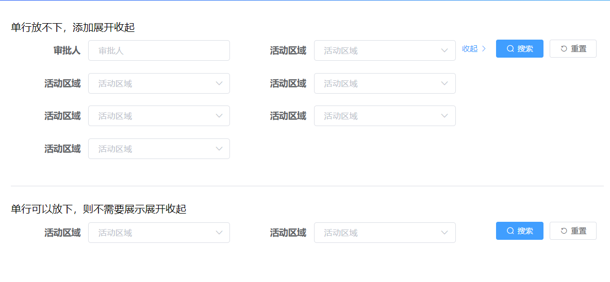
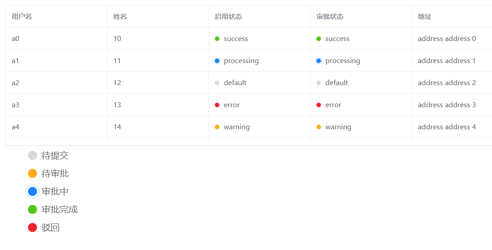

# 基于vue2.0和element-ui开发的实用插件


```
使用方式1: (推荐)
import ElementPlugins from '@hubary/element-plugins/packages/index'
Vue.use(ElementPlugins)

使用方式2:
import "@hubary/element-plugins/dest/element-plugins.css"
import ElementPlugins from "@hubary/element-plugins"

Vue.use(ElementPlugins)

```
### 1. hubary-expand-search
>  提供表格上方搜索栏条件的展开收起的功能


### 2. hubary-remote-search
>  提供基于elementUI封装的远程查询功能
### 3. el-dialog-limit
>  对elementUI的el-dialog进行尺寸的限制,对外提供mini,small,medium,fullscreen四种尺寸的弹窗

### 4. hubary-dot
> 借鉴自[suning uxcool组件库](http://uxcool.suning.com/guide/introduction)的badge状态



## 附加styles/common-space.scss用于生成公共样式

```bash
/*****
* @对外提供以下样式
* @margin   mt-x, mr-x, mb-x, ml-x
* @padding  pt-x, pr-x, pb-x, pl-x
* 使用方式  @include createSpace((5, 10, 15, 16, 20),'前缀')
*@params1 自定义前缀
*@params2 自定义间距
*****/

使用方式1
@import "~@hubary/element-plugins/styles/common-space.scss";
@include createSpace();

使用方式2
import "@hubary/element-plugins/styles/common-space.css"


不带参数createSpace默认生成:

.mt-5  .mt-10  .mt-15  .mt-20
.mr-5  .mr-10  .mr-15  .mr-20
.mb-5  .mb-10  .mb-15  .mb-20
.ml-5  .ml-10  .ml-15  .ml-20

.pt-5  .pt-10  .pt-15  .pt-20
.pr-5  .pr-10  .pr-15  .pr-20
.pb-5  .pb-10  .pb-15  .pb-20
.pl-5  .pl-10  .pl-15  .pl-20
```
